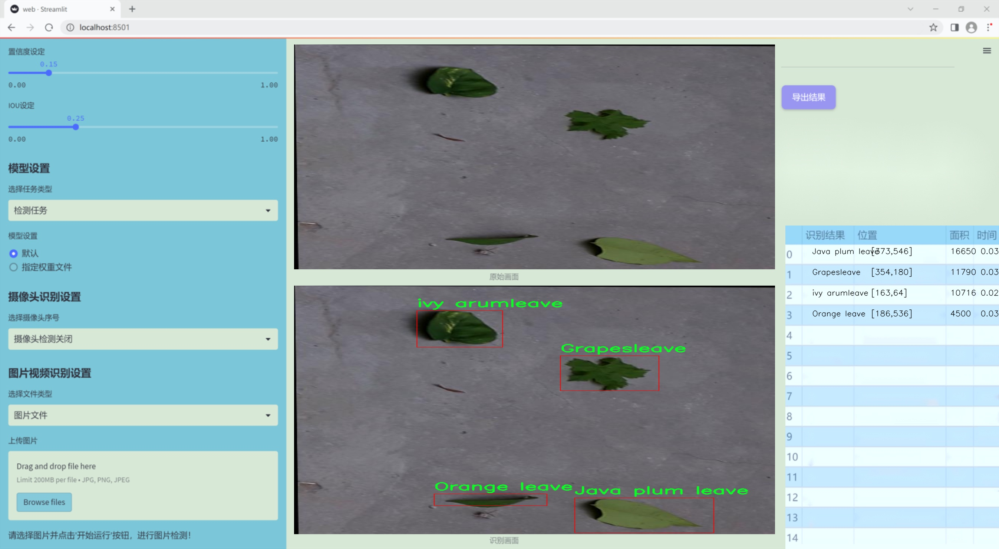
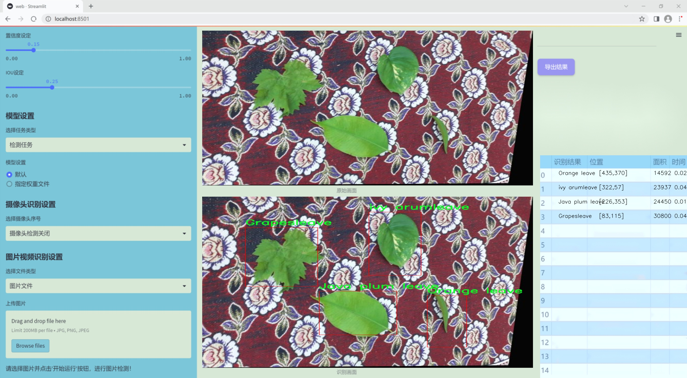
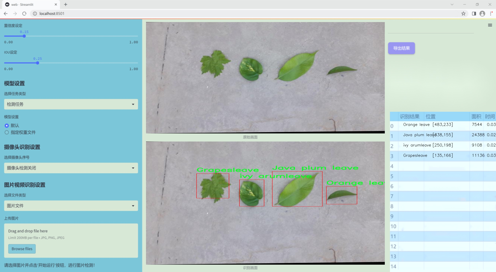
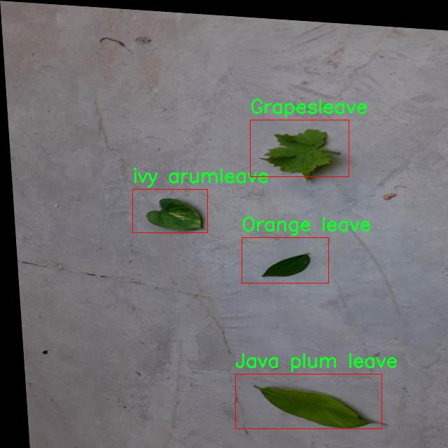
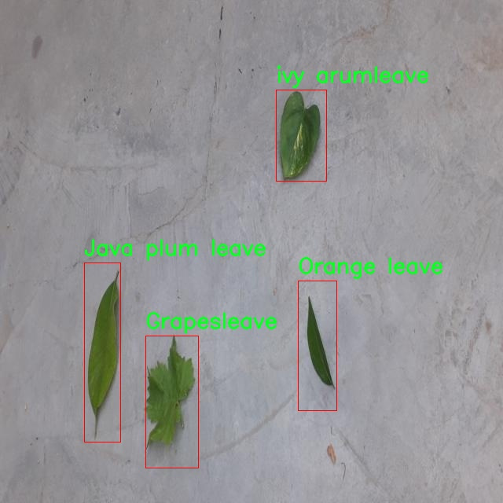
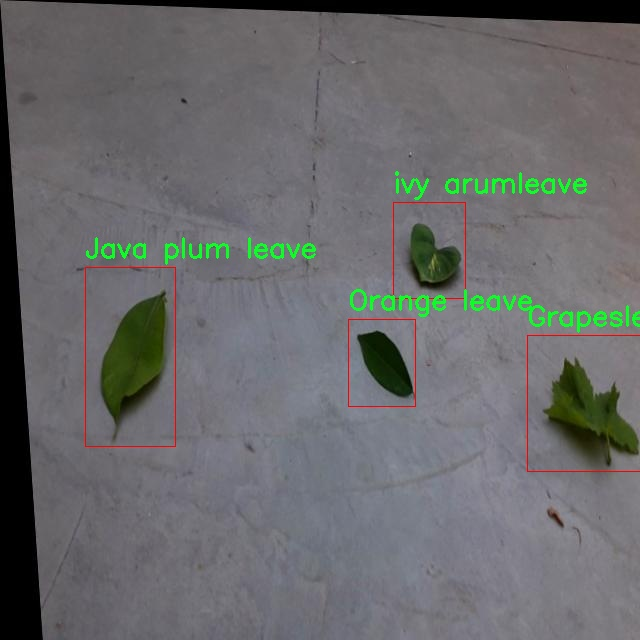
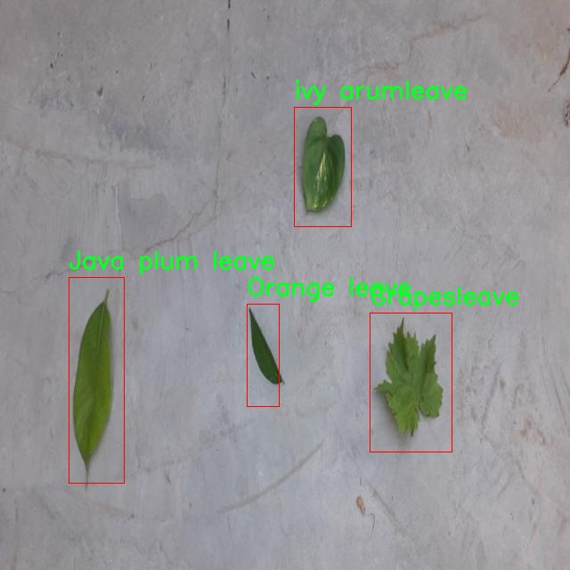
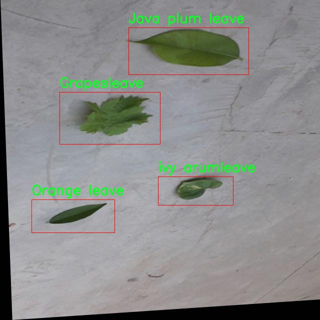

### 1.背景意义

研究背景与意义

随着全球生态环境的变化，植物的多样性及其在生态系统中的重要性日益受到关注。植物叶片的分类不仅是植物学研究的基础，也是生态监测、农业管理和生物多样性保护的重要环节。传统的植物分类方法依赖于人工观察和专家知识，既耗时又容易受到主观因素的影响。近年来，计算机视觉技术的快速发展为植物叶片的自动分类提供了新的解决方案，尤其是基于深度学习的目标检测算法如YOLO（You Only Look Once）系列，因其高效性和准确性而备受青睐。

本研究旨在基于改进的YOLOv11算法，构建一个高效的落叶植物叶片分类系统。我们选择了包含四种不同植物叶片的图像数据集，包括葡萄叶、印度李叶、橙子叶和常春藤叶，数据集共包含4800张经过精心标注的图像。这些图像经过多种预处理和增强技术的处理，确保了模型在不同环境和条件下的鲁棒性。通过对这些叶片进行分类，不仅可以帮助研究人员更好地理解植物的生态特征，还能为农业生产提供科学依据，推动可持续发展。

此外，叶片分类系统的成功应用将为其他植物分类任务提供借鉴，推动计算机视觉技术在生态学和生物多样性研究中的广泛应用。随着数据集的不断扩展和模型的持续优化，该系统有望实现更高的分类精度和更广泛的适用性，从而为生态监测、植物保护和资源管理等领域提供有力支持。总之，本研究不仅具有重要的学术价值，还有助于促进生态环境的保护与可持续发展。

### 2.视频效果

[2.1 视频效果](https://www.bilibili.com/video/BV18QBeYSES7/)

### 3.图片效果







##### [项目涉及的源码数据来源链接](https://kdocs.cn/l/cszuIiCKVNis)**

注意：本项目提供训练的数据集和训练教程,由于版本持续更新,暂不提供权重文件（best.pt）,请按照6.训练教程进行训练后实现上图演示的效果。

### 4.数据集信息

##### 4.1 本项目数据集类别数＆类别名

nc: 4
names: ['Grapesleave', 'Java plum leave', 'Orange leave', 'ivy arumleave']


该项目为【目标检测】数据集，请在【训练教程和Web端加载模型教程（第三步）】这一步的时候按照【目标检测】部分的教程来训练

##### 4.2 本项目数据集信息介绍

本项目数据集信息介绍

本项目旨在改进YOLOv11的落叶植物叶片分类系统，因此我们构建了一个专门用于叶片检测的高质量数据集。该数据集包含四个主要类别，分别是“Grapesleave”（葡萄叶）、“Java plum leave”（番石榴叶）、“Orange leave”（橙子叶）和“ivy arumleave”（常春藤叶）。这些类别的选择不仅考虑了植物的多样性，还兼顾了它们在生态系统中的重要性和经济价值。

数据集的构建过程涉及对不同植物叶片的采集与拍摄，确保每个类别的样本具有代表性和多样性。我们在不同的光照条件和背景下拍摄了大量的叶片图像，以提高模型的鲁棒性和准确性。每个类别的样本数量经过精心设计，以确保模型在训练过程中能够充分学习到各类叶片的特征和差异。

在数据集的标注过程中，我们采用了精确的边界框标注方法，以确保每个叶片的特征能够被准确捕捉。这种细致的标注不仅为模型提供了丰富的训练数据，也为后续的验证和测试提供了可靠的基础。通过对数据集的深入分析，我们还发现不同类别之间在形态、颜色和纹理上的差异，这为改进YOLOv11模型提供了重要的参考。

总之，本项目的数据集不仅为叶片检测提供了丰富的样本和准确的标注，还为改进YOLOv11的分类性能奠定了坚实的基础。通过利用这一数据集，我们期望能够显著提升落叶植物叶片的分类精度，为植物识别和生态研究提供有力支持。











### 5.全套项目环境部署视频教程（零基础手把手教学）

[5.1 所需软件PyCharm和Anaconda安装教程（第一步）](https://www.bilibili.com/video/BV1BoC1YCEKi/?spm_id_from=333.999.0.0&vd_source=bc9aec86d164b67a7004b996143742dc)


[5.2 安装Python虚拟环境创建和依赖库安装视频教程（第二步）](https://www.bilibili.com/video/BV1ZoC1YCEBw?spm_id_from=333.788.videopod.sections&vd_source=bc9aec86d164b67a7004b996143742dc)

### 6.改进YOLOv11训练教程和Web_UI前端加载模型教程（零基础手把手教学）

[6.1 改进YOLOv11训练教程和Web_UI前端加载模型教程（第三步）](https://www.bilibili.com/video/BV1BoC1YCEhR?spm_id_from=333.788.videopod.sections&vd_source=bc9aec86d164b67a7004b996143742dc)


按照上面的训练视频教程链接加载项目提供的数据集，运行train.py即可开始训练



     Epoch   gpu_mem       box       obj       cls    labels  img_size
     1/200     20.8G   0.01576   0.01955  0.007536        22      1280: 100%|██████████| 849/849 [14:42<00:00,  1.04s/it]
               Class     Images     Labels          P          R     mAP@.5 mAP@.5:.95: 100%|██████████| 213/213 [01:14<00:00,  2.87it/s]
                 all       3395      17314      0.994      0.957      0.0957      0.0843

     Epoch   gpu_mem       box       obj       cls    labels  img_size
     2/200     20.8G   0.01578   0.01923  0.007006        22      1280: 100%|██████████| 849/849 [14:44<00:00,  1.04s/it]
               Class     Images     Labels          P          R     mAP@.5 mAP@.5:.95: 100%|██████████| 213/213 [01:12<00:00,  2.95it/s]
                 all       3395      17314      0.996      0.956      0.0957      0.0845

     Epoch   gpu_mem       box       obj       cls    labels  img_size
     3/200     20.8G   0.01561    0.0191  0.006895        27      1280: 100%|██████████| 849/849 [10:56<00:00,  1.29it/s]
               Class     Images     Labels          P          R     mAP@.5 mAP@.5:.95: 100%|███████   | 187/213 [00:52<00:00,  4.04it/s]
                 all       3395      17314      0.996      0.957      0.0957      0.0845


###### [项目数据集下载链接](https://kdocs.cn/l/cszuIiCKVNis)

### 7.原始YOLOv11算法讲解

YOLOv11是一种由Ultralytics公司开发的最新一代目标检测模型，以其增强的特征提取能力和更高的效率在计算机视觉领域引人注目。该模型在架构上进行了关键升级，通过更新主干和颈部结构，显著提高了对复杂视觉场景的理解和处理精度。YOLOv11不仅在目标检测上表现出色，还支持实例分割、图像分类、姿态估计和定向目标检测（OBB）等任务，展示出其多功能性。

与其前身YOLOv8相比，YOLOv11在设计上实现了深度和宽度的改变，同时引入了几个创新机制。其中，C3k2机制是对YOLOv8中的C2f的改进，提升了浅层特征的处理能力；C2PSA机制则进一步优化了特征图的处理流程。解耦头的创新设计，通过增加两个深度卷积（DWConv），提高了模型对细节的感知能力和分类准确性。

在性能上，YOLOv11m模型在COCO数据集上的平均精度（mAP）提高，并减少了22%的参数量，确保了在运算效率上的突破。该模型可以部署在多种平台上，包括边缘设备、云平台以及支持NVIDIA GPU的系统，彰显出卓越的灵活性和适应性。总体而言，YOLOv11通过一系列的创新突破，对目标检测领域产生了深远的影响，并为未来的开发提供了新的研究方向。


****文档**** ： _ _https://docs.ultralytics.com/models/yolo11/__

****代码链接**** ： _ _https://github.com/ultralytics/ultralytics__

******Performance Metrics******


​ ** **关键特性****

****◆**** ** **增强的特征提取能力**** ：YOLO11采用了改进的主干和颈部架构，增强了 ** **特征提取****
能力，能够实现更精确的目标检测和复杂任务的执行。

****◆**** ** **优化的效率和速度****
：YOLO11引入了精细化的架构设计和优化的训练流程，提供更快的处理速度，并在准确性和性能之间保持最佳平衡。

****◆**** ** **参数更少、精度更高****
：通过模型设计的改进，YOLO11m在COCO数据集上实现了更高的平均精度（mAP），同时使用的参数比YOLOv8m少22%，使其在计算上更加高效，而不牺牲准确性。

****◆**** ** **跨环境的适应性**** ：YOLO11可以无缝部署在各种环境中，包括边缘设备、云平台和支持NVIDIA
GPU的系统，确保最大的灵活性。

****◆**** ** **支持广泛任务****
：无论是目标检测、实例分割、图像分类、姿态估计还是定向目标检测（OBB），YOLO11都旨在应对一系列计算机视觉挑战。

****支持的任务和模式****


​YOLO11建立在YOLOv8中引入的多功能模型范围之上，为各种计算机视觉任务提供增强的支持:


​该表提供了YOLO11模型变体的概述，展示了它们在特定任务中的适用性以及与Inference、Validation、Training和Export等操作模式的兼容性。从实时检测到复杂的分割任务
，这种灵活性使YOLO11适用于计算机视觉的广泛应用。

##### yolov11的创新

■ yolov8 VS yolov11

YOLOv5，YOLOv8和YOLOv11均是ultralytics公司的作品，ultralytics出品必属精品。


​ **具体创新点** ：

**① 深度（depth）和宽度 （width）**

YOLOv8和YOLOv11是基本上完全不同。

**② C3k2机制**

C3k2有参数为c3k，其中在网络的浅层c3k设置为False。C3k2就相当于YOLOv8中的C2f。


​ **③ C2PSA机制**

下图为C2PSA机制的原理图。


​ **④ 解耦头**

解耦头中的分类检测头增加了两个 **DWConv** 。


▲Conv

    
    
    def autopad(k, p=None, d=1):  # kernel, padding, dilation
    
        """Pad to 'same' shape outputs."""
    
        if d > 1:
    
            k = d * (k - 1) + 1 if isinstance(k, int) else [d * (x - 1) + 1 for x in k]  # actual kernel-size
    
        if p is None:
    
            p = k // 2 if isinstance(k, int) else [x // 2 for x in k]  # auto-pad
    
    return p
    
    
    class Conv(nn.Module):
    
        """Standard convolution with args(ch_in, ch_out, kernel, stride, padding, groups, dilation, activation)."""
    
    
        default_act = nn.SiLU()  # default activation
    
    
        def __init__(self, c1, c2, k=1, s=1, p=None, g=1, d=1, act=True):
    
            """Initialize Conv layer with given arguments including activation."""
    
            super().__init__()
    
            self.conv = nn.Conv2d(c1, c2, k, s, autopad(k, p, d), groups=g, dilation=d, bias=False)
    
            self.bn = nn.BatchNorm2d(c2)
    
            self.act = self.default_act if act is True else act if isinstance(act, nn.Module) else nn.Identity()
    
    
        def forward(self, x):
    
            """Apply convolution, batch normalization and activation to input tensor."""
    
            return self.act(self.bn(self.conv(x)))
    
    
        def forward_fuse(self, x):
    
            """Perform transposed convolution of 2D data."""
    
            return self.act(self.conv(x))

▲Conv2d

    
    
    torch.nn.Conv2d(in_channels, out_channels, kernel_size, stride=1, padding=0, dilation=1, groups=1, bias=True, padding_mode='zeros')

▲DWConv

DWConv ** **代表 Depthwise Convolution（深度卷积）****
，是一种在卷积神经网络中常用的高效卷积操作。它主要用于减少计算复杂度和参数量。

    
    
    class DWConv(Conv):
    
        """Depth-wise convolution."""
    
    
        def __init__(self, c1, c2, k=1, s=1, d=1, act=True):  # ch_in, ch_out, kernel, stride, dilation, activation
    
            """Initialize Depth-wise convolution with given parameters."""
    
            super().__init__(c1, c2, k, s, g=math.gcd(c1, c2), d=d, act=act)


### 8.200+种全套改进YOLOV11创新点原理讲解

#### 8.1 200+种全套改进YOLOV11创新点原理讲解大全

由于篇幅限制，每个创新点的具体原理讲解就不全部展开，具体见下列网址中的改进模块对应项目的技术原理博客网址【Blog】（创新点均为模块化搭建，原理适配YOLOv5~YOLOv11等各种版本）

[改进模块技术原理博客【Blog】网址链接](https://gitee.com/qunmasj/good)


#### 8.2 精选部分改进YOLOV11创新点原理讲解

###### 这里节选部分改进创新点展开原理讲解(完整的改进原理见上图和[改进模块技术原理博客链接](https://gitee.com/qunmasj/good)【如果此小节的图加载失败可以通过CSDN或者Github搜索该博客的标题访问原始博客，原始博客图片显示正常】


### D-LKA Attention简介
自2010年代中期以来，卷积神经网络（CNNs）已成为许多计算机视觉应用的首选技术。它们能够从原始数据中自动提取复杂的特征表示，无需手动进行特征工程，这引起了医学图像分析社区的极大兴趣。许多成功的CNN架构，如U-Net、全卷积网络、DeepLab或SegCaps（分割胶囊），已经被开发出来。这些架构在语义分割任务中取得了巨大成功，先前的最新方法已经被超越。

在计算机视觉研究中，不同尺度下的目标识别是一个关键问题。在CNN中，可检测目标的大小与相应网络层的感受野尺寸密切相关。如果一个目标扩展到超出这个感受野的边界，这可能会导致欠分割结果。相反，与目标实际大小相比使用过大的感受野可能会限制识别，因为背景信息可能会对预测产生不必要的影响。

解决这个问题的一个有希望的方法涉及在并行使用具有不同尺寸的多个Kernel，类似于Inception块的机制。然而，由于参数和计算要求的指数增长，将Kernel大小增加以容纳更大的目标在实践中受到限制。因此，出现了各种策略，包括金字塔池化技术和不同尺度的扩张卷积，以捕获多尺度的上下文信息。

另一个直观的概念涉及将多尺度图像金字塔或它们的相关特征表示直接纳入网络架构。然而，这种方法存在挑战，特别是在管理训练和推理时间方面的可行性方面存在挑战。在这个背景下，使用编码器-解码器网络，如U-Net，已被证明是有利的。这样的网络在较浅的层中编码外观和位置，而在更深的层中，通过神经元的更广泛的感受野捕获更高的语义信息和上下文信息。

一些方法将来自不同层的特征组合在一起，或者预测来自不同尺寸的层的特征以使用多尺度的信息。此外，出现了从不同尺度的层中预测特征的方法，有效地实现了跨多个尺度的见解整合。然而，大多数编码器-解码器结构面临一个挑战：它们经常无法在不同尺度之间保持一致的特征，并主要使用最后一个解码器层生成分割结果。

语义分割是一项任务，涉及根据预定义的标签集为图像中的每个像素预测语义类别。这项任务要求提取高级特征同时保留初始的空间分辨率。CNNs非常适合捕获局部细节和低级信息，尽管以忽略全局上下文为代价。视觉Transformer（ViT）架构已经成为解决处理全局信息的视觉任务的关键，包括语义分割，取得了显著的成功。

ViT的基础是注意力机制，它有助于在整个输入序列上聚合信息。这种能力使网络能够合并远程的上下文提示，超越了CNN的有限感受野尺寸。然而，这种策略通常会限制ViT有效建模局部信息的能力。这种局限可能会妨碍它们检测局部纹理的能力，这对于各种诊断和预测任务至关重要。这种缺乏局部表示可以归因于ViT模型处理图像的特定方式。

ViT模型将图像分成一系列Patch，并使用自注意力机制来模拟它们之间的依赖关系。这种方法可能不如CNN模型中的卷积操作对感受野内提取局部特征有效。ViT和CNN模型之间的这种图像处理方法的差异可能解释了CNN模型在局部特征提取方面表现出色的原因。

近年来，已经开发出创新性方法来解决Transformer模型内部局部纹理不足的问题。其中一种方法是通过互补方法将CNN和ViT特征结合起来，以结合它们的优势并减轻局部表示的不足。TransUNet是这种方法的早期示例，它在CNN的瓶颈中集成了Transformer层，以模拟局部和全局依赖关系。HiFormer提出了一种解决方案，将Swin Transformer模块和基于CNN的编码器结合起来，生成两个多尺度特征表示，通过Double-Level Fusion模块集成。UNETR使用基于Transformer的编码器和CNN解码器进行3D医学图像分割。CoTr和TransBTS通过Transformer在低分辨率阶段增强分割性能，将CNN编码器和解码器连接在一起。

增强局部特征表示的另一种策略是重新设计纯Transformer模型内部的自注意力机制。在这方面，Swin-Unet在U形结构中集成了一个具有线性计算复杂性的Swin Transformer块作为多尺度 Backbone 。MISSFormer采用高效Transformer来解决视觉Transformer中的参数问题，通过在输入块上进行不可逆的降采样操作。D-Former引入了一个纯Transformer的管道，具有双重注意模块，以分段的方式捕获细粒度的局部注意和与多元单元的交互。然而，仍然存在一些特定的限制，包括计算效率低下，如TransUNet模型所示，对CNN Backbone 的严重依赖，如HiFormer所观察到的，以及对多尺度信息的忽略。

此外，目前的分割架构通常采用逐层处理3D输入 volumetric 的方法，无意中忽视了相邻切片之间的潜在相关性。这一疏忽限制了对 volumetric 信息的全面利用，因此损害了定位精度和上下文集成。此外，必须认识到，医学领域的病变通常在形状上发生变形。因此，用于医学图像分析的任何学习算法都必须具备捕捉和理解这些变形的能力。与此同时，该算法应保持计算效率，以便处理3D volumetric数据。

为了解决上述提到的挑战，作者提出了一个解决方案，即可变形大卷积核注意力模块（Deformable LKA module），它是作者网络设计的基本构建模块。这个模块明确设计成在有效处理上下文信息的同时保留局部描述符。作者的架构在这两个方面的平衡增强了实现精确语义分割的能力。

值得注意的是，参考该博客引入了一种基于数据的感受野的动态适应，不同于传统卷积操作中的固定滤波器Mask。这种自适应方法使作者能够克服与静态方法相关的固有限制。这种创新方法还扩展到了D-LKA Net架构的2D和3D版本的开发。

在3D模型的情况下，D-LKA机制被量身定制以适应3D环境，从而实现在不同 volumetric 切片之间无缝信息交互。最后，作者的贡献通过其计算效率得到进一步强调。作者通过仅依靠D-LKA概念的设计来实现这一点，在各种分割基准上取得了显著的性能，确立了作者的方法作为一种新的SOTA方法。

在本节中，作者首先概述方法论。首先，作者回顾了由Guo等人引入的大卷积核注意力（Large Kernel Attention，LKA）的概念。然后，作者介绍了作者对可变形LKA模块的创新探索。在此基础上，作者介绍了用于分割任务的2D和3D网络架构。

大卷积核提供了与自注意力机制类似的感受野。可以通过使用深度卷积、深度可扩展卷积和卷积来构建大卷积核，从而减少了参数和计算量。构建输入维度为和通道数的卷积核的深度卷积和深度可扩展卷积的卷积核大小的方程如下：


具有卷积核大小和膨胀率。参数数量和浮点运算（FLOPs）的计算如下：


FLOPs的数量与输入图像的大小成线性增长。参数的数量随通道数和卷积核大小的增加而呈二次增长。然而，由于它们通常都很小，因此它们不是限制因素。

为了最小化对于固定卷积核大小K的参数数量，可以将方程3对于膨胀率的导数设定为零：


例如，当卷积核大小为时，结果是。将这些公式扩展到3D情况是直接的。对于大小为和通道数C的输入，3D情况下参数数量和FLOPs 的方程如下：


具有卷积核大小和膨胀。


利用大卷积核进行医学图像分割的概念通过引入可变形卷积得以扩展。可变形卷积可以通过整数偏移自由调整采样网格以进行自由变形。额外的卷积层从特征图中学习出变形，从而创建一个偏移场。基于特征本身学习变形会导致自适应卷积核。这种灵活的卷积核形状可以提高病变或器官变形的表示，从而增强了目标边界的定义。

负责计算偏移的卷积层遵循其相应卷积层的卷积核大小和膨胀。双线性插值用于计算不在图像网格上的偏移的像素值。如图2所示，D-LKA模块可以表示为：


其中输入特征由表示，。表示为注意力图，其中每个值表示相应特征的相对重要性。运算符  表示逐元素乘法运算。值得注意的是，LKA不同于传统的注意力方法，它不需要额外的规范化函数，如或。这些规范化函数往往忽视高频信息，从而降低了基于自注意力的方法的性能。

在该方法的2D版本中，卷积层被可变形卷积所替代，因为可变形卷积能够改善对具有不规则形状和大小的目标的捕捉能力。这些目标在医学图像数据中常常出现，因此这种增强尤为重要。

然而，将可变形LKA的概念扩展到3D领域会带来一定的挑战。主要的约束来自于需要用于生成偏移的额外卷积层。与2D情况不同，由于输入和输出通道的性质，这一层无法以深度可分的方式执行。在3D环境中，输入通道对应于特征，而输出通道扩展到，其中是卷积核的大小。大卷积核的复杂性导致沿第3D的通道数扩展，导致参数和FLOPs大幅增加。因此，针对3D情况采用了另一种替代方法。在现有的LKA框架中，深度卷积之后引入了一个单独的可变形卷积层。这种战略性的设计调整旨在减轻扩展到3D领域所带来的挑战。


2D网络的架构如图1所示。第一变种使用MaxViT作为编码器组件，用于高效特征提取，而第二变种则结合可变形LKA层进行更精细、卓越的分割。

在更正式的描述中，编码器生成4个分层输出表示。首先，卷积干扰将输入图像的维度减小到。随后，通过4个MaxViT块的4个阶段进行特征提取，每个阶段后跟随降采样层。随着过程进展到解码器，实施了4个阶段的D-LKA层，每个阶段包含2个D-LKA块。然后，应用Patch扩展层以实现分辨率上采样，同时减小通道维度。最后，线性层负责生成最终的输出。

2D D-LKA块的结构包括LayerNorm、可变形LKA和多层感知器（MLP）。积分残差连接确保了有效的特征传播，即使在更深层也是如此。这个安排可以用数学方式表示为：


其中输入特征，层归一化LN，可变形LKA注意力，深度卷积，线性层和GeLU激活函数。

3D网络架构如图1所示，采用编码器-解码器设计进行分层结构化。首先，一个Patch嵌入层将输入图像的维度从（）减小到（）。在编码器中，采用了3个D-LKA阶段的序列，每个阶段包含3个D-LKA块。在每个阶段之后，通过降采样步骤将空间分辨率减半，同时将通道维度加倍。中央瓶颈包括另一组2个D-LKA块。解码器结构与编码器相对称。

为了将特征分辨率加倍，同时减少通道数，使用转置卷积。每个解码器阶段都使用3个D-LKA块来促进远距离特征依赖性。最终的分割输出由一个卷积层产生，后面跟随一个卷积层以匹配特定类别的通道要求。

为了建立输入图像和分割输出之间的直接连接，使用卷积形成了一个跳跃连接。额外的跳跃连接根据简单的加法对来自其他阶段的特征进行融合。最终的分割图是通过和卷积层的组合产生的。

3D D-LKA块包括层归一化，后跟D-LKA注意力，应用了残差连接的部分。随后的部分采用了一个卷积层，后面跟随一个卷积层，两者都伴随着残差连接。这个整个过程可以总结如下：


带有输入特征 、层归一化 、可变形 LKA 、卷积层 和输出特征 的公式。是指一个前馈网络，包括2个卷积层和激活函数。

表7显示了普通卷积和构建卷积的参数数量比较。尽管标准卷积的参数数量在通道数较多时急剧增加，但分解卷积的参数总体较低，并且增长速度不那么快。

与分解卷积相比，可变形分解卷积增加了大量参数，但仍然明显小于标准卷积。可变形卷积的主要参数是由偏移网络创建的。在这里，作者假设可变形深度卷积的Kernel大小为（5,5），可变形深度空洞卷积的Kernel大小为（7,7）。这导致了21×21大小的大Kernel的最佳参数数量。更高效地生成偏移量的方法将大大减少参数数量。


值得注意的是，引入可变形LKA确实会增加模型的参数数量和每秒的浮点运算次数（FLOPS）。然而，重要的是强调，这增加的计算负载不会影响作者模型的整体推理速度。

相反，对于Batch-size > 1，作者甚至观察到推理时间的减少，如图7所示。例如，基于作者的广泛实验，作者观察到对于Batch-size为16，具有可变形卷积和没有可变形卷积的推理时间分别为8.01毫秒和17.38毫秒。作者认为这是由于在2D中对可变形卷积的高效实现所致。为了测量时间，使用了大小为（）的随机输入。在GPU热身周期50次迭代之后，网络被推断了1000次。测量是在NVIDIA RTX 3090 GPU上进行的。


为了充分利用性能与参数之间的权衡关系，作者在图8中可视化了在Synapse 2D数据集上报告的DSC和HD性能以及基于参数数量的内存消耗。D-LKA Net引入了相当多的参数，约为101M。这比性能第二好的方法ScaleFormer使用的111.6M参数要少。

与更轻量级的DAEFormer模型相比，作者实现了更好的性能，这证明了参数增加的合理性。大多数参数来自于MaxViT编码器；因此，将编码器替换为更高效的编码器可以减少模型参数。值得注意的是，在此可视化中，作者最初将HD和内存值都归一化到[0, 100]范围内。随后，作者将它们从100缩小，以增强更高值的表示。


### 9.系统功能展示

图9.1.系统支持检测结果表格显示

  图9.2.系统支持置信度和IOU阈值手动调节

  图9.3.系统支持自定义加载权重文件best.pt(需要你通过步骤5中训练获得)

  图9.4.系统支持摄像头实时识别

  图9.5.系统支持图片识别

  图9.6.系统支持视频识别

  图9.7.系统支持识别结果文件自动保存

  图9.8.系统支持Excel导出检测结果数据


### 10. YOLOv11核心改进源码讲解

#### 10.1 dyhead_prune.py

以下是对给定代码的核心部分进行分析和详细注释的结果。我们将保留主要的类和函数，并为其添加中文注释，以便更好地理解其功能和实现。

```python
import torch
import torch.nn as nn
import torch.nn.functional as F

# 定义一个函数，用于确保某个值是可被指定的除数整除的
def _make_divisible(v, divisor, min_value=None):
    if min_value is None:
        min_value = divisor
    new_v = max(min_value, int(v + divisor / 2) // divisor * divisor)
    # 确保向下取整不会超过原值的90%
    if new_v < 0.9 * v:
        new_v += divisor
    return new_v

# Swish激活函数
class swish(nn.Module):
    def forward(self, x):
        return x * torch.sigmoid(x)

# h_swish激活函数
class h_swish(nn.Module):
    def __init__(self, inplace=False):
        super(h_swish, self).__init__()
        self.inplace = inplace

    def forward(self, x):
        return x * F.relu6(x + 3.0, inplace=self.inplace) / 6.0

# h_sigmoid激活函数
class h_sigmoid(nn.Module):
    def __init__(self, inplace=True, h_max=1):
        super(h_sigmoid, self).__init__()
        self.relu = nn.ReLU6(inplace=inplace)
        self.h_max = h_max

    def forward(self, x):
        return self.relu(x + 3) * self.h_max / 6

# 动态ReLU激活函数
class DyReLU(nn.Module):
    def __init__(self, inp, reduction=4, lambda_a=1.0, K2=True, use_bias=True, use_spatial=False,
                 init_a=[1.0, 0.0], init_b=[0.0, 0.0]):
        super(DyReLU, self).__init__()
        self.oup = inp  # 输出通道数
        self.lambda_a = lambda_a * 2  # 动态调整参数
        self.K2 = K2  # 是否使用K2
        self.avg_pool = nn.AdaptiveAvgPool2d(1)  # 自适应平均池化

        self.use_bias = use_bias
        self.exp = 4 if use_bias else 2 if K2 else 2 if use_bias else 1  # 确定扩展因子
        squeeze = _make_divisible(inp // reduction, 4)  # 确定压缩因子

        # 定义全连接层
        self.fc = nn.Sequential(
            nn.Linear(inp, squeeze),
            nn.ReLU(inplace=True),
            nn.Linear(squeeze, self.oup * self.exp),
            h_sigmoid()
        )
        self.spa = nn.Sequential(
            nn.Conv2d(inp, 1, kernel_size=1),
            nn.BatchNorm2d(1),
        ) if use_spatial else None  # 可选的空间注意力

    def forward(self, x):
        # 输入处理
        x_in = x[0] if isinstance(x, list) else x
        x_out = x[1] if isinstance(x, list) else x
        b, c, h, w = x_in.size()  # 获取输入的尺寸
        y = self.avg_pool(x_in).view(b, c)  # 自适应平均池化
        y = self.fc(y).view(b, self.oup * self.exp, 1, 1)  # 全连接层输出

        # 根据扩展因子计算输出
        if self.exp == 4:
            a1, b1, a2, b2 = torch.split(y, self.oup, dim=1)
            a1 = (a1 - 0.5) * self.lambda_a + self.init_a[0]
            a2 = (a2 - 0.5) * self.lambda_a + self.init_a[1]
            b1 = b1 - 0.5 + self.init_b[0]
            b2 = b2 - 0.5 + self.init_b[1]
            out = torch.max(x_out * a1 + b1, x_out * a2 + b2)
        elif self.exp == 2:
            a1, b1 = torch.split(y, self.oup, dim=1)
            a1 = (a1 - 0.5) * self.lambda_a + self.init_a[0]
            b1 = b1 - 0.5 + self.init_b[0]
            out = x_out * a1 + b1

        elif self.exp == 1:
            a1 = y
            a1 = (a1 - 0.5) * self.lambda_a + self.init_a[0]
            out = x_out * a1

        # 如果使用空间注意力，则进行处理
        if self.spa:
            ys = self.spa(x_in).view(b, -1)
            ys = F.softmax(ys, dim=1).view(b, 1, h, w) * h * w
            ys = F.hardtanh(ys, 0, 3, inplace=True) / 3
            out = out * ys

        return out

# 动态可变形卷积模块
class DyDCNv2(nn.Module):
    def __init__(self, in_channels, out_channels, stride=1, norm_cfg=dict(type='GN', num_groups=16, requires_grad=True)):
        super().__init__()
        self.with_norm = norm_cfg is not None
        bias = not self.with_norm
        self.conv = ModulatedDeformConv2d(
            in_channels, out_channels, 3, stride=stride, padding=1, bias=bias)
        if self.with_norm:
            self.norm = build_norm_layer(norm_cfg, out_channels)[1]

    def forward(self, x, offset, mask):
        """前向传播函数"""
        x = self.conv(x.contiguous(), offset, mask)  # 进行可变形卷积
        if self.with_norm:
            x = self.norm(x)  # 进行归一化
        return x

# DyHead模块
class DyHeadBlock_Prune(nn.Module):
    def __init__(self, in_channels, norm_type='GN', zero_init_offset=True, act_cfg=dict(type='HSigmoid', bias=3.0, divisor=6.0)):
        super().__init__()
        self.zero_init_offset = zero_init_offset
        self.offset_and_mask_dim = 3 * 3 * 3  # 偏移和掩码的维度
        self.offset_dim = 2 * 3 * 3  # 偏移的维度

        # 根据规范类型选择归一化配置
        norm_dict = dict(type='GN', num_groups=16, requires_grad=True) if norm_type == 'GN' else dict(type='BN', requires_grad=True)
        
        # 定义空间卷积层
        self.spatial_conv_high = DyDCNv2(in_channels, in_channels, norm_cfg=norm_dict)
        self.spatial_conv_mid = DyDCNv2(in_channels, in_channels)
        self.spatial_conv_low = DyDCNv2(in_channels, in_channels, stride=2)
        self.spatial_conv_offset = nn.Conv2d(in_channels, self.offset_and_mask_dim, 3, padding=1)  # 偏移卷积层
        
        # 定义尺度注意力模块
        self.scale_attn_module = nn.Sequential(
            nn.AdaptiveAvgPool2d(1), nn.Conv2d(in_channels, 1, 1),
            nn.ReLU(inplace=True), build_activation_layer(act_cfg))
        
        # 定义任务注意力模块
        self.task_attn_module = DyReLU(in_channels)
        self._init_weights()  # 初始化权重

    def _init_weights(self):
        for m in self.modules():
            if isinstance(m, nn.Conv2d):
                normal_init(m, 0, 0.01)  # 正态初始化卷积层
        if self.zero_init_offset:
            constant_init(self.spatial_conv_offset, 0)  # 偏移卷积层初始化为0

    def forward(self, x, level):
        """前向传播函数"""
        # 计算偏移和掩码
        offset_and_mask = self.spatial_conv_offset(x[level])
        offset = offset_and_mask[:, :self.offset_dim, :, :]
        mask = offset_and_mask[:, self.offset_dim:, :, :].sigmoid()

        mid_feat = self.spatial_conv_mid(x[level], offset, mask)  # 中间特征
        sum_feat = mid_feat * self.scale_attn_module(mid_feat)  # 加权特征
        summed_levels = 1
        
        # 处理低层特征
        if level > 0:
            low_feat = self.spatial_conv_low(x[level - 1], offset, mask)
            sum_feat += low_feat * self.scale_attn_module(low_feat)
            summed_levels += 1
        
        # 处理高层特征
        if level < len(x) - 1:
            high_feat = F.interpolate(
                self.spatial_conv_high(x[level + 1], offset, mask),
                size=x[level].shape[-2:],
                mode='bilinear',
                align_corners=True)
            sum_feat += high_feat * self.scale_attn_module(high_feat)
            summed_levels += 1

        return self.task_attn_module(sum_feat / summed_levels)  # 返回任务注意力模块的输出
```

### 代码核心部分总结：
1. **激活函数**：定义了多种激活函数（Swish, h_swish, h_sigmoid, DyReLU），用于提高模型的非线性表达能力。
2. **动态可变形卷积**：`DyDCNv2`类实现了可变形卷积，并可选择性地应用归一化。
3. **DyHead模块**：`DyHeadBlock_Prune`类实现了具有多种注意力机制的模块，能够根据输入特征动态调整卷积的偏移和掩码。

这些核心部分共同构成了一个灵活且强大的深度学习模块，适用于各种计算机视觉任务。

该文件`dyhead_prune.py`实现了一些深度学习模型中的模块，主要用于动态头（Dynamic Head）结构，通常应用于目标检测等任务。文件中使用了PyTorch框架，并引入了一些额外的库用于构建激活层和归一化层。

首先，文件定义了一个辅助函数`_make_divisible`，该函数用于确保输入的值能够被指定的除数整除，并且不会小于给定的最小值。这个函数常用于网络结构设计中，以确保通道数等参数的合理性。

接下来，文件定义了几个激活函数类，包括`swish`、`h_swish`和`h_sigmoid`。这些类都继承自`nn.Module`，并实现了`forward`方法，具体实现了相应的激活函数。`swish`函数是一种新型激活函数，`h_swish`和`h_sigmoid`则是基于ReLU6的变体，适用于特定的深度学习模型。

然后，文件定义了`DyReLU`类，这是一个动态ReLU模块。它的构造函数接受多个参数，包括输入通道数、缩减比例、初始化参数等。`DyReLU`的前向传播方法根据输入的特征图计算输出，使用了自适应平均池化和全连接层。该模块还支持空间注意力机制，通过卷积和批归一化来实现。

接着，定义了`DyDCNv2`类，这是一个带有归一化层的可调变形卷积模块。它使用了`ModulatedDeformConv2d`，并在前向传播中计算偏移量和掩码，支持多种归一化方式（如分组归一化和批归一化）。

最后，文件定义了`DyHeadBlock_Prune`类，这是一个包含三种注意力机制的动态头块。构造函数中初始化了多个卷积层和注意力模块。`forward`方法计算输入特征图的偏移量和掩码，并通过不同的卷积层进行特征提取和融合，最终输出经过任务注意力模块处理的特征图。

总体来说，该文件实现了动态头结构中的多个关键组件，利用了可调变形卷积和动态激活函数，以提高模型在目标检测等任务中的性能。

#### 10.2 activation.py

```python
import torch
import torch.nn as nn

class AGLU(nn.Module):
    """AGLU激活函数模块，来源于https://github.com/kostas1515/AGLU。"""

    def __init__(self, device=None, dtype=None) -> None:
        """初始化AGLU激活函数模块。"""
        super().__init__()
        # 使用Softplus作为基础激活函数，beta设为-1.0
        self.act = nn.Softplus(beta=-1.0)
        # 初始化lambda参数，并将其定义为可学习的参数
        self.lambd = nn.Parameter(nn.init.uniform_(torch.empty(1, device=device, dtype=dtype)))  # lambda参数
        # 初始化kappa参数，并将其定义为可学习的参数
        self.kappa = nn.Parameter(nn.init.uniform_(torch.empty(1, device=device, dtype=dtype)))  # kappa参数

    def forward(self, x: torch.Tensor) -> torch.Tensor:
        """计算AGLU激活函数的前向传播。"""
        # 将lambda参数限制在最小值0.0001，避免数值不稳定
        lam = torch.clamp(self.lambd, min=0.0001)
        # 计算AGLU激活函数的输出
        return torch.exp((1 / lam) * self.act((self.kappa * x) - torch.log(lam)))
```

### 代码注释说明：
1. **导入必要的库**：引入PyTorch库及其神经网络模块。
2. **AGLU类**：定义了一个名为`AGLU`的类，继承自`nn.Module`，表示一个自定义的激活函数模块。
3. **初始化方法**：
   - `super().__init__()`：调用父类的初始化方法。
   - `self.act`：使用`Softplus`作为基础激活函数，`beta`参数设置为-1.0。
   - `self.lambd`和`self.kappa`：这两个参数是可学习的，分别用于控制激活函数的形状和输出，初始化为均匀分布的随机值。
4. **前向传播方法**：
   - `torch.clamp`：将`lambd`参数限制在最小值0.0001，以避免在计算中出现数值不稳定。
   - 返回值：计算并返回AGLU激活函数的输出，使用了指数函数和Softplus的组合。

这个程序文件 `activation.py` 定义了一个名为 `AGLU` 的激活函数模块，属于 Ultralytics YOLO 项目的一部分，遵循 AGPL-3.0 许可证。该模块使用 PyTorch 框架实现，主要用于深度学习模型中的激活函数。

在文件的开头，首先导入了必要的库，包括 `torch` 和 `torch.nn`。接着定义了 `AGLU` 类，该类继承自 `nn.Module`，表示一个神经网络模块。

在 `AGLU` 类的构造函数 `__init__` 中，初始化了激活函数的相关参数。首先调用 `super().__init__()` 来初始化父类。然后，使用 `nn.Softplus` 激活函数，并将其赋值给 `self.act`。`Softplus` 是一种平滑的激活函数，具有类似于 ReLU 的特性。接下来，定义了两个可学习的参数 `lambd` 和 `kappa`，它们是通过均匀分布初始化的，并使用 `nn.Parameter` 包装，以便在训练过程中能够更新这两个参数。

`forward` 方法实现了前向传播的计算逻辑。它接收一个输入张量 `x`，并首先对 `lambd` 参数进行裁剪，确保其值不小于 0.0001，以避免数值不稳定。然后，计算激活函数的输出，使用公式 `torch.exp((1 / lam) * self.act((self.kappa * x) - torch.log(lam)))`，其中 `self.act` 是之前定义的 `Softplus` 激活函数。

总的来说，这个模块实现了一种统一的激活函数，结合了可学习的参数，以增强模型的表达能力，适用于深度学习任务中的非线性变换。

#### 10.3 transformer.py

以下是保留的核心代码部分，并添加了详细的中文注释：

```python
import torch
import torch.nn as nn
from functools import partial

# 引入自定义的归一化模块
from .prepbn import RepBN, LinearNorm
from ..modules.transformer import TransformerEncoderLayer

# 定义一个线性归一化的部分函数
ln = nn.LayerNorm
linearnorm = partial(LinearNorm, norm1=ln, norm2=RepBN, step=60000)

class TransformerEncoderLayer_RepBN(TransformerEncoderLayer):
    def __init__(self, c1, cm=2048, num_heads=8, dropout=0, act=..., normalize_before=False):
        # 初始化父类TransformerEncoderLayer
        super().__init__(c1, cm, num_heads, dropout, act, normalize_before)
        
        # 使用自定义的线性归一化
        self.norm1 = linearnorm(c1)
        self.norm2 = linearnorm(c1)

class AIFI_RepBN(TransformerEncoderLayer_RepBN):
    """定义AIFI变换器层。"""

    def __init__(self, c1, cm=2048, num_heads=8, dropout=0, act=nn.GELU(), normalize_before=False):
        """使用指定参数初始化AIFI实例。"""
        super().__init__(c1, cm, num_heads, dropout, act, normalize_before)

    def forward(self, x):
        """AIFI变换器层的前向传播。"""
        c, h, w = x.shape[1:]  # 获取输入张量的通道数、高度和宽度
        pos_embed = self.build_2d_sincos_position_embedding(w, h, c)  # 构建2D正弦余弦位置嵌入
        # 将输入张量从形状[B, C, H, W]展平为[B, HxW, C]
        x = super().forward(x.flatten(2).permute(0, 2, 1), pos=pos_embed.to(device=x.device, dtype=x.dtype))
        # 将输出张量的形状转换回[B, C, H, W]
        return x.permute(0, 2, 1).view([-1, c, h, w]).contiguous()

    @staticmethod
    def build_2d_sincos_position_embedding(w, h, embed_dim=256, temperature=10000.0):
        """构建2D正弦余弦位置嵌入。"""
        assert embed_dim % 4 == 0, "嵌入维度必须是4的倍数，以便进行2D正弦余弦位置嵌入"
        grid_w = torch.arange(w, dtype=torch.float32)  # 创建宽度的网格
        grid_h = torch.arange(h, dtype=torch.float32)  # 创建高度的网格
        grid_w, grid_h = torch.meshgrid(grid_w, grid_h, indexing="ij")  # 生成网格坐标
        pos_dim = embed_dim // 4  # 计算位置嵌入的维度
        omega = torch.arange(pos_dim, dtype=torch.float32) / pos_dim  # 计算频率
        omega = 1.0 / (temperature**omega)  # 根据温度调整频率

        # 计算宽度和高度的正弦余弦值
        out_w = grid_w.flatten()[..., None] @ omega[None]
        out_h = grid_h.flatten()[..., None] @ omega[None]

        # 返回拼接后的正弦余弦位置嵌入
        return torch.cat([torch.sin(out_w), torch.cos(out_w), torch.sin(out_h), torch.cos(out_h)], 1)[None]
```

### 代码核心部分解释：
1. **类定义**：
   - `TransformerEncoderLayer_RepBN` 继承自 `TransformerEncoderLayer`，并在构造函数中初始化了两个归一化层。
   - `AIFI_RepBN` 继承自 `TransformerEncoderLayer_RepBN`，实现了前向传播和位置嵌入的构建。

2. **前向传播**：
   - 在 `forward` 方法中，输入张量 `x` 的形状被转换为适合变换器的格式，并计算出位置嵌入。

3. **位置嵌入构建**：
   - `build_2d_sincos_position_embedding` 方法生成了2D正弦余弦位置嵌入，用于增强模型对位置信息的理解。

### 重要性：
这段代码实现了一个自定义的变换器层，结合了特殊的归一化方法和位置嵌入方式，适用于处理图像等二维数据，能够提高模型的表现。

这个程序文件 `transformer.py` 定义了一个基于 Transformer 的编码层，主要用于处理图像或其他二维数据。它使用了改进的归一化方法（RepBN）和线性归一化（LinearNorm），并实现了一个特定的 Transformer 层（AIFI_RepBN）。

首先，文件导入了必要的 PyTorch 库，包括神经网络模块和功能模块。接着，使用 `functools.partial` 创建了一个 `linearnorm` 函数，该函数结合了 LayerNorm 和 RepBN，并设置了一个步数参数（step=60000），这在训练过程中可能用于调整归一化的行为。

接下来，定义了一个名为 `TransformerEncoderLayer_RepBN` 的类，它继承自 `TransformerEncoderLayer`。在初始化方法中，调用了父类的构造函数，并为该层定义了两个归一化层 `norm1` 和 `norm2`，这两个层都使用了之前定义的 `linearnorm`。

然后，定义了 `AIFI_RepBN` 类，继承自 `TransformerEncoderLayer_RepBN`，并在其构造函数中设置了一些默认参数，如 `cm`、`num_heads`、`dropout` 和激活函数（默认为 GELU）。这个类代表了一个特定的 Transformer 层，名为 AIFI。

在 `AIFI_RepBN` 类中，重写了 `forward` 方法，该方法负责前向传播。首先，它获取输入张量 `x` 的形状，并调用 `build_2d_sincos_position_embedding` 方法生成二维的正弦-余弦位置嵌入。然后，将输入张量从形状 `[B, C, H, W]` 展平为 `[B, HxW, C]`，并传递给父类的 `forward` 方法进行处理。最后，将输出张量的形状恢复为 `[B, C, H, W]`。

`build_2d_sincos_position_embedding` 是一个静态方法，用于生成二维的正弦-余弦位置嵌入。该方法首先检查嵌入维度是否可以被4整除，这是生成位置嵌入的要求。然后，创建两个网格（grid_w 和 grid_h），分别表示宽度和高度的坐标。接着，计算嵌入的频率（omega），并使用这些频率生成正弦和余弦的嵌入。最终，返回一个包含正弦和余弦值的张量。

总的来说，这个文件实现了一个基于 Transformer 的编码层，结合了先进的归一化技术和位置嵌入方法，适用于处理具有空间结构的数据。

#### 10.4 test_selective_scan_speed.py

以下是代码中最核心的部分，并附上详细的中文注释：

```python
import torch
import torch.nn.functional as F

def build_selective_scan_fn(selective_scan_cuda: object = None, mode="mamba_ssm", tag=None):
    """
    构建选择性扫描函数的工厂函数，返回一个可用于前向和反向传播的自定义函数。
    
    参数:
    selective_scan_cuda: 自定义CUDA实现的选择性扫描函数
    mode: 选择性扫描的模式
    tag: 标签，用于标识不同的选择性扫描实现
    """
    
    class SelectiveScanFn(torch.autograd.Function):
        @staticmethod
        def forward(ctx, u, delta, A, B, C, D=None, z=None, delta_bias=None, delta_softplus=False, return_last_state=False, nrows=1, backnrows=-1):
            """
            前向传播函数，计算选择性扫描的输出。
            
            参数:
            ctx: 上下文对象，用于保存信息以供反向传播使用
            u: 输入张量
            delta: 增量张量
            A, B, C: 相关参数张量
            D: 可选的张量
            z: 可选的张量
            delta_bias: 可选的增量偏置
            delta_softplus: 是否使用softplus激活
            return_last_state: 是否返回最后的状态
            nrows: 行数
            backnrows: 反向行数
            
            返回:
            输出张量或输出和最后状态的元组
            """
            # 确保输入张量是连续的
            if u.stride(-1) != 1:
                u = u.contiguous()
            if delta.stride(-1) != 1:
                delta = delta.contiguous()
            if D is not None:
                D = D.contiguous()
            if B.stride(-1) != 1:
                B = B.contiguous()
            if C.stride(-1) != 1:
                C = C.contiguous()
            if z is not None and z.stride(-1) != 1:
                z = z.contiguous()

            # 处理输入的维度和形状
            if B.dim() == 3:
                B = rearrange(B, "b dstate l -> b 1 dstate l")
                ctx.squeeze_B = True
            if C.dim() == 3:
                C = rearrange(C, "b dstate l -> b 1 dstate l")
                ctx.squeeze_C = True

            # 确保数据类型为float
            if D is not None and (D.dtype != torch.float):
                ctx._d_dtype = D.dtype
                D = D.float()
            if delta_bias is not None and (delta_bias.dtype != torch.float):
                ctx._delta_bias_dtype = delta_bias.dtype
                delta_bias = delta_bias.float()

            # 进行选择性扫描的计算
            if mode == "mamba_ssm":
                out, x, *rest = selective_scan_cuda.fwd(u, delta, A, B, C, D, z, delta_bias, delta_softplus)
            else:
                raise NotImplementedError("未实现的模式")

            # 保存需要用于反向传播的张量
            ctx.save_for_backward(u, delta, A, B, C, D, delta_bias, x)
            last_state = x[:, :, -1, 1::2]  # 获取最后的状态
            return out if not return_last_state else (out, last_state)

        @staticmethod
        def backward(ctx, dout):
            """
            反向传播函数，计算梯度。
            
            参数:
            ctx: 上下文对象，包含前向传播时保存的信息
            dout: 上游梯度
            
            返回:
            输入张量的梯度
            """
            u, delta, A, B, C, D, delta_bias, x = ctx.saved_tensors
            
            # 计算反向传播的梯度
            du, ddelta, dA, dB, dC, dD, ddelta_bias, *rest = selective_scan_cuda.bwd(
                u, delta, A, B, C, D, delta_bias, dout, x, None, False
            )

            return (du, ddelta, dA, dB, dC, dD if D is not None else None, ddelta_bias if delta_bias is not None else None)

    def selective_scan_fn(u, delta, A, B, C, D=None, z=None, delta_bias=None, delta_softplus=False, return_last_state=False, nrows=1, backnrows=-1):
        """
        封装选择性扫描函数的调用，方便使用。
        """
        return SelectiveScanFn.apply(u, delta, A, B, C, D, z, delta_bias, delta_softplus, return_last_state, nrows, backnrows)

    return selective_scan_fn
```

### 代码说明：
1. **`build_selective_scan_fn`**: 这是一个工厂函数，用于创建选择性扫描的自定义函数。它接受CUDA实现、模式和标签作为参数。

2. **`SelectiveScanFn`**: 这是一个继承自`torch.autograd.Function`的类，定义了前向和反向传播的逻辑。

3. **`forward`方法**: 计算选择性扫描的输出。它处理输入的形状和数据类型，并调用CUDA实现的前向函数。

4. **`backward`方法**: 计算反向传播的梯度，使用CUDA实现的反向函数。

5. **`selective_scan_fn`**: 封装`SelectiveScanFn`的调用，简化使用。

通过这些核心部分，用户可以方便地进行选择性扫描的前向和反向传播计算。

这个程序文件 `test_selective_scan_speed.py` 是一个用于测试选择性扫描（Selective Scan）算法性能的脚本，主要使用 PyTorch 框架实现。程序的核心部分是定义了一些函数和类，用于实现选择性扫描的前向和反向传播操作，并通过不同的模式和参数进行性能测试。

首先，文件导入了必要的库，包括 PyTorch、数学运算库、时间库和其他一些工具库。接着，定义了一个构建选择性扫描函数的工厂函数 `build_selective_scan_fn`，该函数接受一个 CUDA 实现的选择性扫描函数和一些配置参数，返回一个自定义的选择性扫描函数 `selective_scan_fn`。

在 `SelectiveScanFn` 类中，定义了前向传播 `forward` 和反向传播 `backward` 方法。前向传播方法处理输入数据的维度和连续性，确保输入张量是连续的。然后，根据不同的模式调用相应的 CUDA 实现，计算输出和中间状态，并保存必要的张量以供反向传播使用。反向传播方法则根据保存的上下文计算梯度，支持多种输入情况和数据类型。

此外，文件中还定义了多个选择性扫描的参考实现函数，例如 `selective_scan_ref`、`selective_scan_easy` 和 `selective_scan_easy_v2`，这些函数实现了选择性扫描的基本逻辑，处理输入数据并返回计算结果。

在 `test_speed` 函数中，设置了一些测试参数，包括数据类型、序列长度、批量大小和状态维度等。然后生成随机输入数据，调用不同的选择性扫描实现进行性能测试。通过记录每个实现的执行时间，比较它们的速度和效率。

最后，脚本通过 `test_speed` 函数执行所有的性能测试，并打印出每个测试的执行时间。这个程序的设计目的是为了评估不同选择性扫描实现的性能，帮助开发者选择最合适的实现方式。

### 11.完整训练+Web前端界面+200+种全套创新点源码、数据集获取


# [下载链接：https://mbd.pub/o/bread/Z5iZmpdp](https://mbd.pub/o/bread/Z5iZmpdp)